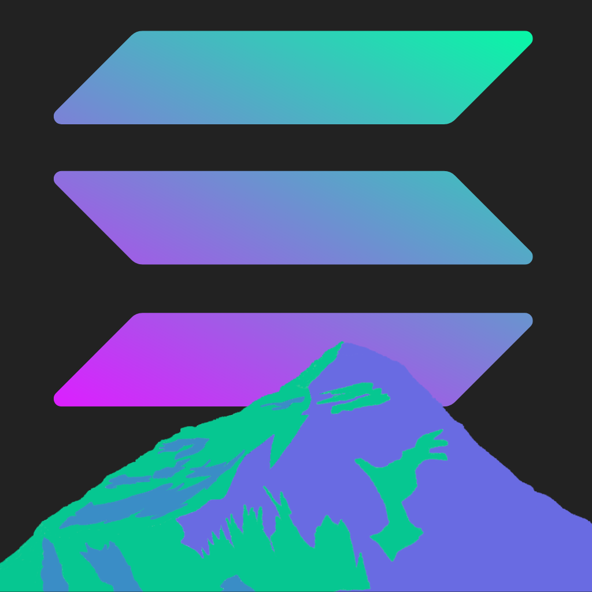
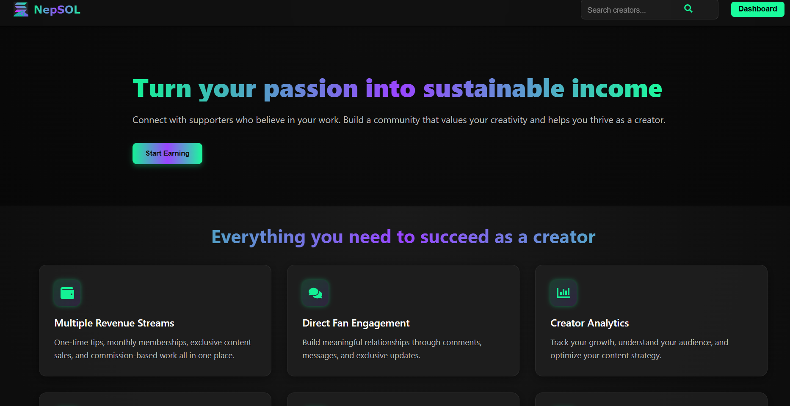
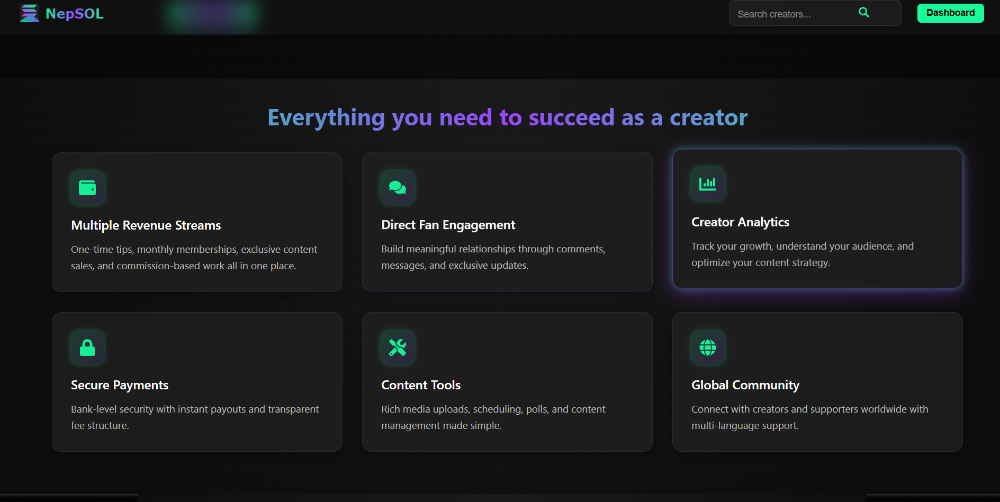
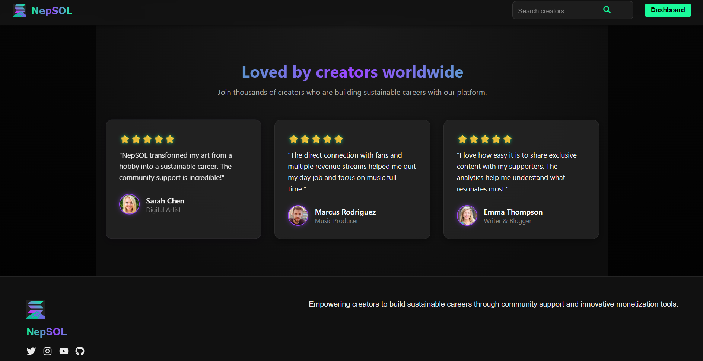
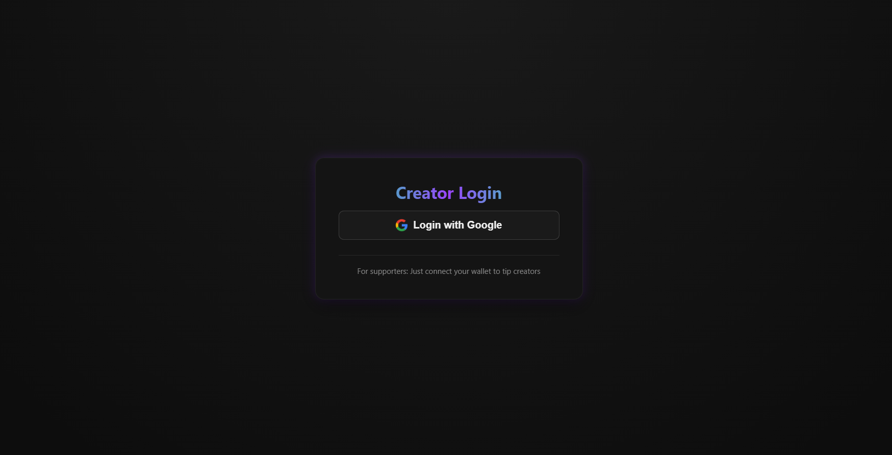
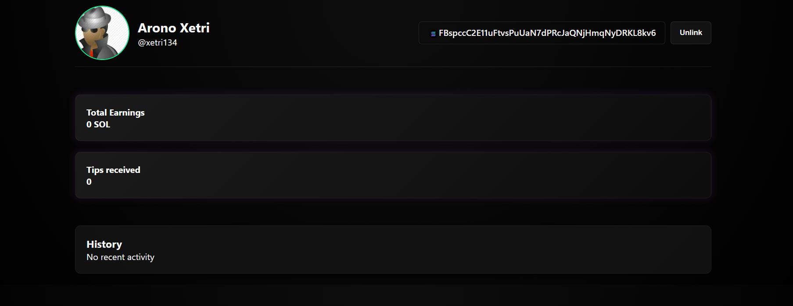
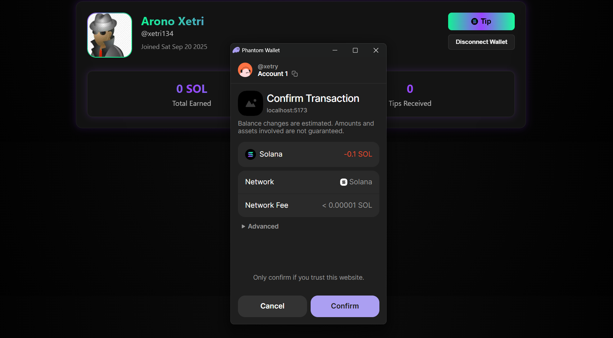

#  NepSOL | Turn Your Passion into Sustainable Income

### Connect with supporters who believe in your work. Build a community that values your creativity and helps you thrive as a creator.

## Features

- Multiple revenue Streams
- Direct Fan Engagement
- Creator Analytics
- Secure Payments
- Content Tools
- Global Community

## Tech Stack

### Frontend
- React
- Firebase
- @solana/web3.js

### Backend
- Bun.js
- Typescript
- Hono
- Firebase-Admin

## Visuals

<div style="display: flex; flex-direction: column; justify-content: center; align-items: center;">













</div>

## Project Setup
To get a local copy, follow these simple steps:

## Prerequisites
- Nodejs LTS

## Installation Steps

### 1. Clone the repo

```bash
git clone https://github.com/xetri/NepSOL
```

### 2. Install dependencies and setup the prequesities

```bash
npm run install-deps
npm run setup
```

### 3. Setup the environment variables

```bash
# Backend
PORT=3000
SERVICE_ACCOUNT_CREDENTIALS="{}"
SERVICE_ACCOUNT_FILE="service-account.key.json"

# Frontend
VITE_NODE_ENV="development"

VITE_FIREBASE_API_KEY=""
VITE_FIREBASE_AUTH_DOMAIN=""
VITE_FIREBASE_PROJECT_ID=""
VITE_FIREBASE_APP_ID=""

VITE_BACKEND_ENDPOINT="http://localhost:3000"

VITE_SOLANA_MAINNET="https://api.mainnet-beta.solana.com"
VITE_SOLANA_TESTNET="https://api.testnet.solana.com"
```

### 4. Build
```bash
npm run build
```

### 5. Start
```bash
npm run start
```

####  Go to [Localhost](localhost:5173) or your configured domain.

## Contributors
- [Pratyush Shrestha](https://github.com/PratyushShrestha-web)
- [Avinash Pokhrel](https://github.com/xetri)

----

## Thanks to SuperTeam Nepal for providing this opportunity to gain hands-on development experience and boost our confidence as developers.